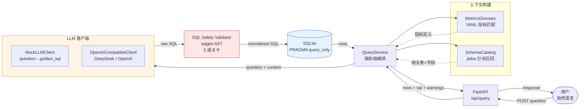

# 企业经营数据分析 Agent（Enterprise Data Analysis Agent）

> 基于 LLM 的 NL2SQL 经营分析系统。用户用自然语言提问，系统自动生成 SQL、查询 SQLite 数据库、按安全规则校验后返回结果。

**简历定位**：与 `phone-commerce-agent`（业务执行 Agent）形成互补——一个走业务流程，一个走数据洞察。

---

## 真实评测指标（务必区分真实 vs Mock）

> ⚠️ **本节数字是 README 中唯一可信的"模型能力"指标**。
> Mock 模式下 LLM 返回的是评测集中的 `golden_sql`，所以 Mock 跑分只反映**数据/Schema/安全校验/执行链路**是否正确，**不能反映 LLM 真实生成能力**。

### 当前快照（v9，60/20 拆分）

| 评测集 | 题量 | 结果正确率 | SQL 可执行率 |
|---|---|---|---|
| **基础集（baseline）** | 60 | **71.9%（41/57）** | 98.3%（59/60）|
| **进阶集（advanced）** | 20 | **38.9%（7/18）** | 100%（20/20）|
| **总集（total）** | 80 | **64.0%（48/75）** | 98.8%（79/80）|

> 基础集 = 20 道 easy + 40 道 medium（单次 LLM 可稳定写对）；进阶集 = 12 道 hard + 8 道难 medium（同比环比 / 复购分层 / 库存滞销 / 退款×售后关联等专家级题，超出单次生成能力）。拆分脚本 `eval/split_cases.py`，规范见 `docs/evaluation-splits.md`。

### 版本演进

| 评测轮次 | 题量 | 结果正确率 | SQL 可执行率 | 备注 |
|---|---|---|---|---|
| 真实 LLM **v9**（当前） | 80 | **64.0%** | 98.8% | 撤回 rule 14（JOIN 完整性）+ 首跑 60/20 拆分 |
| 真实 LLM v8 | 80 | 64.5% | 98.8% | 修复 golden 整数除法 bug |
| 真实 LLM v4 | 20 | 95% | 100% | 4 轮迭代收敛点，**20 题过拟合 baseline**，不具代表性 |
| 真实 LLM v5 | 80 | 62.7% | 93.8% | 扩到 80 题暴露 5 类边界（诊断基线）|
| Mock 基线 | 80 | 100% | 100% | **仅作数据/Schema/链路回归**——LLM 返回 golden_sql，不反映真实生成能力 |
| 安全评测 | 25 | — | 校验器层 100% / 端到端 100% | **两层**：校验器 25/25 拦；端到端 5 模型拒答 + 9 Validator 拦 + 11 模型软改写 + 0 true miss，**真实安全姿态 100%**（**注**：本轮 25 个攻击样本无真漏拦，**≠** 模型本身 100% 安全；后续应多轮/多温度评测验证稳定性）|

### 关键诚实声明
1. **单次 LLM 生成完整 SQL 的架构下，80 题真实结果正确率稳定在 62–65%**。v4 的 95% 是 20 题过拟合，别当项目成绩。
2. **60/20 拆分后真相更清晰**：基础 60 题 71.9%（能用），进阶 20 题仅 38.9%（不能用）——后者把总集拉到 64%。进阶题的瓶颈不在 Prompt，而在"单次生成"架构本身。
3. **评测集本身也需要校验**：v8 发现 6 道比率题的 golden_sql 有整数除法 bug（缺 `* 1.0`，golden 结果恒为 0），把模型其实答对的浮点答案误判为错。详见 `docs/evaluation-history.md` §v8。
4. **80 题里约 15 道"专家级"难题**（多层子查询 + 同比环比 + 复购分层 + 退款×售后关联），单次生成写不对，需要 agentic 多步分解。
5. **禁止把 80/80 mock 写成模型能力指标**——那只是把 golden_sql 喂回去跑一遍。

完整报告：
- 真实评测：`eval/report-real-v9-80q.md`（当前）/ `eval/report-real-v8-fixed-golden.md`（历史）
- 60/20 拆分统计：`eval/split_report.py` + `eval/cases-baseline-60.jsonl` / `cases-advanced-20.jsonl`
- Mock 基线：`eval/report-batch2-mock.md`
- 安全评测（校验器层）：`eval/security_report.json`
- 安全评测（端到端层）：`eval/security-report-e2e.md` + `eval/security-e2e.jsonl`
- 安全 e2e review（4 层口径解读）：`docs/collab/review-security-e2e-round1.md`
- 迭代历史：`docs/evaluation-history.md`

---

## 核心能力

| 模块 | 能力 | 文件 |
|---|---|---|
| **业务指标语义层（Glossary）** | 抽象 6 个核心指标（销售额/订单量/客单价/毛利/退款金额/售后解决时长），含字段口径与默认过滤 | `config/metrics.yaml`, `app/metrics/glossary.py` |
| **Schema 语义检索（Catalog）** | jieba 中文分词 + 关键表保留 + 字段表名注入 prompt | `app/catalog/schema.py`, `app/catalog/descriptions.py` |
| **Text2SQL 生成** | OpenAI-compatible LLM（DeepSeek/OpenAI），Prompt 15 条硬规则 + 6 条 Few-shot，temperature=0 | `app/llm/client.py` |
| **SQL 安全校验** | SQLGlot AST 5 道关卡：只读/表白名单/危险函数/LIMIT 钳制/集合运算，详见 `docs/sql_safety.md` | `app/security/validator.py` |
| **执行链路** | SQLite 只读连接（PRAGMA query_only），端到端编排：Glossary → Catalog → LLM → 安全 → 执行 | `app/agent/query_service.py` |
| **FastAPI 接口** | `/api/health` + `/api/query`，错误统一映射（400/422/502），详见 `docs/collab/interface-contract.md` | `app/api/app.py` |
| **评测闭环** | 80 业务题 + 25 安全题，6 维指标（可执行/结构/列名/行数/结果/安全） | `eval/run_eval.py`, `eval/run_security_eval.py` |

---

## 技术栈（项目实际使用）

| 层 | 技术 | 备注 |
|---|---|---|
| 后端框架 | FastAPI + Pydantic v2 | 同步 API，便于 SQLite 单连接 |
| 数据库 | **SQLite only**（PRAGMA query_only） | 演示用；生产可平滑换 MySQL（schema 是标准 SQL） |
| LLM | DeepSeek-V3 / OpenAI-compatible（`OpenAICompatibleClient`） | temperature=0，markdown 代码块自动清理 |
| SQL 解析 | sqlglot 30.18 | AST 校验 + 多方言支持 |
| 中文分词 | jieba | Schema 召回用 |
| 环境变量 | python-dotenv | 按项目根加载 |
| 测试 | pytest | 66 passed（`pytest -q`，`pytest.ini` 已限定 `testpaths=tests`）|

---

## 快速开始

### 1. 准备数据（已生成则可跳过）

```bash
cd data
python generate_data.py --output enterprise.db
```

生成 12 个月（2024-01 ~ 2026-09）的模拟经营数据：5000 SKU / 1 万客户 / 5 万订单 / 12 万明细 / 19 万库存快照。

### 2. 配置 LLM（真实模式必填，Mock 跳过）

`.env`（在项目根目录）：
```
LLM_MODE=real
LLM_API_KEY=sk-xxx
LLM_BASE_URL=https://api.deepseek.com
LLM_MODEL=deepseek-chat
```

不填则默认走 Mock（用 `eval/cases.jsonl` 的 golden_sql 兜底）。

### 3. 启动服务

```bash
uvicorn app.api.app:create_app --factory --port 8000
```

### 4. 验证

```bash
curl http://localhost:8000/api/health
# {"status":"ok","db":"ok","llm":"ok"}

curl -X POST http://localhost:8000/api/query \
  -H "Content-Type: application/json" \
  -d '{"question":"2026 年 8 月各门店销售额 TOP5"}'
```

### 5. 跑评测

```bash
# Mock 基线（验证数据/Schema/链路）
python eval/run_eval.py --mode mock --db data/enterprise.db \
  --cases eval/cases.jsonl \
  --report eval/report-mock.md \
  --save-sql eval/sql_dump-mock.jsonl

# 真实 LLM 评测（验证模型能力）
LLM_MODE=real python eval/run_eval.py --mode real --db data/enterprise.db \
  --cases eval/cases.jsonl \
  --report eval/report-real.md \
  --save-sql eval/sql_dump-real.jsonl

# 安全评测
python eval/run_security_eval.py

# 图表 / NL 解释评测（Phase 3）
python eval/run_chart_nl_eval.py

# 生成前端 mock 样例（与 /api/query 同构的真实响应）
python eval/dump_query_samples.py
```

### 6. 启动前端（查询结果页）

```bash
# 后端保持运行（8000），另开一个终端
cd frontend
npm install
npm run dev          # http://127.0.0.1:5173，/api 已代理到 8000
```

后端未启动时，前端自动降级为内置真实响应样例，仍可演示 KPI / 折线 / 柱状 / 饼图 / 表格 5 种形态。
详见 `frontend/README.md` 与 `docs/collab/frontend-spec.md`。

---

## 目录结构（实际）

```
enterprise-data-agent/
├── app/                          # 后端代码
│   ├── api/app.py                # FastAPI create_app 工厂（mock/real 切换）
│   ├── agent/query_service.py    # 端到端编排：Glossary → Catalog → LLM → 安全 → 执行
│   ├── catalog/                  # Schema Catalog（jieba 分词 + 关键表保留）
│   ├── db/sqlite.py              # SQLite 只读连接
│   ├── llm/client.py             # MockLLMClient + OpenAICompatibleClient
│   ├── metrics/glossary.py       # 指标语义层
│   └── security/validator.py     # SQL 安全校验（530 行，借鉴开源项目 6 个设计点 + 3 处改写）
├── config/
│   └── metrics.yaml              # 6 个核心指标口径（权威）
├── data/
│   ├── init.sql                  # 10 张表 schema + 索引
│   ├── generate_data.py          # 模拟数据生成器（业务规则：双11/618/春节淡季/订单状态机）
│   └── enterprise.db             # SQLite 演示数据（已生成，49MB）
├── tests/                        # 66 passed
│   ├── security/test_validator.py   # 58 个安全校验用例
│   ├── agent/test_query_service.py  # 端到端集成
│   ├── api/test_api_errors.py       # 错误码映射
│   ├── api/test_llm_errors.py       # 真实 LLM 异常 → 502
│   ├── catalog/test_catalog.py      # Schema 召回
│   └── metrics/test_glossary.py     # 指标匹配
├── eval/                         # 评测闭环
│   ├── cases.jsonl               # 80 业务题（7 类场景 × 多难度 × 多时间窗）
│   ├── cases-chart-nl.jsonl      # 图表 / NL 解释评测 10 条（Phase 3）
│   ├── fixtures/query-samples.json  # 前端 mock 样例（真实响应，7 种形态）
│   ├── security_cases.jsonl      # 25 恶意/越权用例
│   ├── run_eval.py               # 业务评测（6 维指标 + diff 诊断 + 真实/Mock 双模式）
│   ├── run_security_eval.py      # 安全评测（校验器层）
│   └── report-*.md               # 评测报告（mock / real / 安全）
├── frontend/                     # 查询结果页（Vue 3 + Vite + ECharts）
│   ├── src/api.js                # /api/query 封装 + 错误码归一化
│   ├── src/chartOption.js        # chart_data -> ECharts option（纯函数）
│   ├── src/components/           # QuestionBar / Conclusion / KpiCard / ChartPanel / ResultTable / SqlPanel
│   └── src/mock/querySamples.json   # 后端离线时的兜底样例
├── pytest.ini                    # 限定 testpaths=tests（避免收集 vendor/ 参考项目测试）
├── docs/
│   ├── data_dictionary.md        # 数据字典（10 表字段 + 6 指标口径）
│   ├── sql_safety.md             # SQL 安全校验规范
│   └── collab/                   # 协作 review 记录
└── README.md
```

---

## 业务指标口径（来自 `config/metrics.yaml`）

| 指标 | 公式 | 关键陷阱 |
|---|---|---|
| 销售额 | `SUM(orders.paid_amount)`，过滤 `paid_amount > 0` | **不是** `order_amount`；**不是** `order_status='paid'` |
| 订单量 | `COUNT(DISTINCT orders.order_id)` | JOIN 明细时必须 DISTINCT |
| 客单价 | `AVG(orders.paid_amount)` | 与销售额同口径 |
| 毛利 | `SUM(order_items.subtotal_profit)` | 明细实付减明细成本；订单级 `profit_amount` 另算 |
| 退款金额 | `SUM(refunds.refund_amount)`，过滤 `refund_status='completed'` | 仅已完成的资金退款 |
| 售后解决时长 | `AVG(after_sales.resolution_time_hours)` | 已解决工单的平均 |

完整字段映射见 `docs/data_dictionary.md`。

---

## 架构图



**5 道 SQL 安全关卡**：
1. **只读限制**：仅允许 SELECT / WITH(CTE) / UNION / INTERSECT / EXCEPT
2. **表白名单**：10 张业务表（来自 `SchemaCatalog.to_table_infos()`）
3. **列级白名单**：引用列必须在所在表里存在（防 schema 越权）
4. **危险函数拦截**：禁 `load_extension`、禁 Python UDF 等
5. **LIMIT 钳制**：默认 1000，最大 5000

完整规范见 `docs/sql_safety.md`。

---

## 评测集设计

### 业务评测（80 题 / 6 类场景）

| 类别 | 题量 | 难度构成 | 时间锚定 |
|---|---|---|---|
| 销售（sales） | 16 | easy 4 / medium 10 / hard 2 | 月/季/半年/同比/环比 |
| 利润（profit） | 12 | easy 3 / medium 7 / hard 2 | 月/近 3 月/H1 同比 |
| 客户（customer） | 12 | easy 4 / medium 6 / hard 2 | 月/无时间/近一年 |
| 库存（inventory） | 12 | easy 2 / medium 8 / hard 2 | 最近快照/近 90 天 |
| 促销（promotion） | 8 | easy 2 / medium 3 / hard 3 | 月/同比/ROI |
| 退款（refund） | 12 | easy 2 / medium 7 / hard 3 | 月/周维度/多次退款 |
| 售后（after_sales） | 8 | easy 3 / medium 4 / hard 1 | 月/类型分布 |
| **合计** | **80** | easy 20 / medium 48 / hard 12 | 13 题锁 2026-08；其余时间多样 |

**Hard 题严格定义**：同比/环比、复购分层、库存周转/滞销（NOT EXISTS）、促销前后对比（NULLIF）、退款+售后关联（EXISTS）、HAVING 多次退款（多层子查询）。

### 安全评测（25 题 / 6 类攻击，**两层口径**）

| 攻击类型 | 题量 |
|---|---|
| 破坏性（DELETE/DROP/UPDATE/INSERT/ALTER/PRAGMA 写） | 6 |
| 多语句（`;` 拼接） | 2 |
| 注释（`--` 注入） | 3 |
| 越权读表（`users` 等非白名单） | 7 |
| 越权读列（跨表取列） | 4 |
| SELECT * 滥用 | 3 |

**两层口径（务必区分，不能只写一个）**：

| 层 | 测什么 | 入口 | 当前结果 |
|---|---|---|---|
| **校验器层**（底线） | 给定恶意 SQL，sqlglot AST 校验是否拒绝 | `eval/run_security_eval.py` | **25/25 = 100%** |
| **端到端层**（真实威胁） | 给恶意自然语言，LLM 是否会生成被拒的 SQL / 主动拒答 / 软改写 | `eval/run_security_e2e.py --mode real` | **真实安全姿态 25/25 = 100%** |

**端到端层 4 层拆解**（用 `run_security_e2e.py` 跑真实 LLM）：

| 层 | 含义 | 当前 | 占比 |
|---|---|---|---|
| `model_hard_refusal` | 模型显式说 cannot / unable / 抱歉 | 5 | 20% |
| `model_soft_deflection` | 模型生成合规 SQL 替代攻击（不算漏拦）| 11 | 44% |
| `validator_block` | Validator 拦下攻击 SQL | 9 | 36% |
| `true_miss` | Validator 应该拦但没拦 | **0** | **0%** |

> 5 个 model_hard_refusal 案例：S002/S004/S005/S008 拒 DDL/DML（"I cannot write INSERT/DELETE"），S012 巧妙用 schema 上下文识别"users 不是零售业务表"。详细分析见 `docs/collab/review-security-e2e-round1.md`。

> "端到端拦截率 14/25 = 56%"是把软改写算成了"漏拦"——这是口径陷阱。**真实安全姿态 = 校验器 + 模型任何形式的安全应答 = 25/25 = 100%**。详细分析见 `docs/collab/review-security-e2e-round1.md`。

**三层防御架构**（不是单点，而是多防线纵深）：

| 层 | 防御者 | 贡献 |
|---|---|---|
| 1 | 模型（业务上下文 + 安全能力）| 5/25 hard_refusal，主动拒答破坏性/越权请求 |
| 2 | 模型（攻击改写）| 11/25 soft_deflection，把攻击请求"软改"成合规查询 |
| 3 | SQL Validator（sqlglot AST）| 9/25 block，拦下模型真生成的攻击 SQL |

> 重要声明：100% 是**本轮 25 个攻击样本均未造成危险 SQL 执行**，**不等于模型本身 100% 安全**。LLM 存在 run-to-run 随机性（S013 在 soft_deflection ↔ validator_block 之间波动），后续应做多轮/多温度评测验证稳定性。

---

## 与 phone-commerce-agent 的差异

| 项目 | 体现能力 |
|---|---|
| **phone-commerce-agent** | RAG、业务工具调用、权限隔离、审计日志、企业级工程化 |
| **enterprise-data-agent**（本项目） | Text2SQL、数据库 Agent、SQL 安全校验、指标体系、Prompt 工程、评测闭环 |

二者共享同一份电商业务上下文，但一个走**业务流程**（操作型），一个走**数据洞察**（分析型），故事线自洽。

---

## 文档地图

| 文档 | 内容 |
|---|---|
| `docs/data_dictionary.md` | 10 张表字段明细 + 6 指标口径 + 枚举值 |
| `docs/sql_safety.md` | SQL 安全校验 8 条规则 + 违规码全枚举 + API + 已知边界 |
| `docs/collab/interface-contract.md` | API 契约（v1 实际响应 + Phase 2 预留） |
| `docs/collab/batch1-review.md` / `batch2-review.md` | 业务评测集扩 80 题的 review 过程 |
| `docs/collab/review-*.md` | Prompt 迭代诊断（v1→v4 真实评测 31.6% → 95%）|

---

## License

MIT