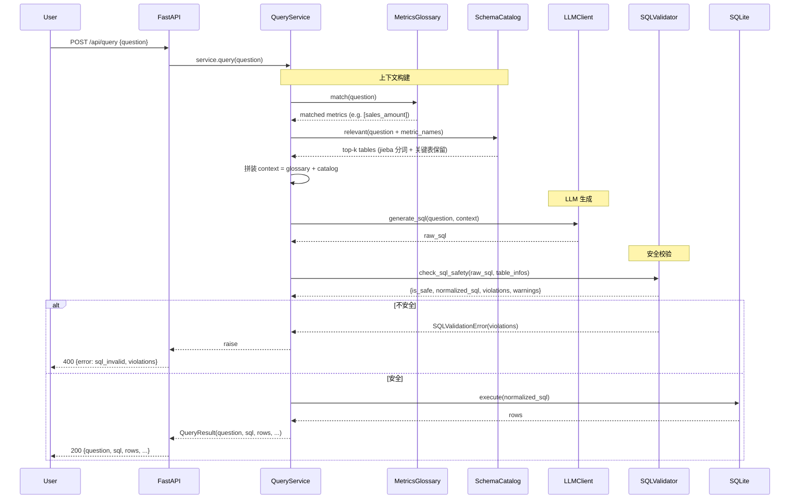
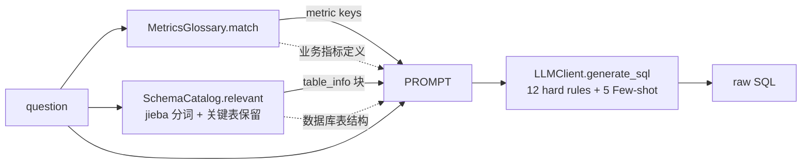

# 架构设计（Architecture）

> 本文档描述 enterprise-data-agent 的模块划分、数据流、依赖关系与扩展点。
> README 提供快览，本文档提供深度。

---

## 1. 分层架构

```
┌──────────────────────────────────────────────────────────────┐
│  API 层      FastAPI create_app 工厂（app/api/app.py）         │
│              - 错误映射：SQLValidationError→400 / httpx→502  │
├──────────────────────────────────────────────────────────────┤
│  编排层      QueryService（app/agent/query_service.py）        │
│              - 串联 Glossary + Catalog + LLM + 安全 + 执行     │
├──────────────────────────────────────────────────────────────┤
│  语义层      ┌─ MetricsGlossary ─ YAML 指标匹配 ──┐            │
│              └─ SchemaCatalog ─ jieba + 关键表 ─┘            │
├──────────────────────────────────────────────────────────────┤
│  LLM 层      LLMClient 抽象                                     │
│              ├─ MockLLMClient     (eval 回归基线)              │
│              └─ OpenAICompatibleClient (DeepSeek/OpenAI)      │
├──────────────────────────────────────────────────────────────┤
│  安全层      check_sql_safety (app/security/validator.py)       │
│              - sqlglot AST 5 道关卡                            │
├──────────────────────────────────────────────────────────────┤
│  数据层      SQLiteDatabase (app/db/sqlite.py)                 │
│              - PRAGMA query_only=ON                            │
└──────────────────────────────────────────────────────────────┘
```

---

## 2. 端到端数据流



---

## 3. 模块依赖（自上而下）

| 上层 | 下层 | 关系 |
|---|---|---|
| `app/api/app.py` | `app/agent/query_service` + `app/db/sqlite` + `app/catalog/*` + `app/llm/client` + `app/metrics/glossary` + `app/security/validator` | 工厂装配所有依赖 |
| `app/agent/query_service.py` | `SchemaCatalog` + `MetricsGlossary` + `LLMClient` + `check_sql_safety` + `db.execute` | 编排 |
| `app/catalog/schema.py` | `sqlite3` + `app/catalog/descriptions` | SQL 查 Schema |
| `app/metrics/glossary.py` | `PyYAML` + `config/metrics.yaml` | 加载指标 |
| `app/llm/client.py` | `httpx` + `python-dotenv` | HTTP 调用 LLM |
| `app/security/validator.py` | `sqlglot` | AST 校验 |
| `app/db/sqlite.py` | `sqlite3`（stdlib） | 只读连接 |

**依赖原则**：
- LLM 层不依赖 SQL/DB 层（`LLMClient` 只关心 `generate_sql(question, context) -> str`）
- 安全层不依赖 LLM/DB（只接受 SQL 字符串 + 表信息）
- 编排层（`QueryService`）是唯一的"胶水"，方便替换任一组件

---

## 4. 接口契约（实际 v1）

### `POST /api/query`

请求：
```json
{ "question": "2026 年 8 月各门店销售额 TOP5" }
```

成功响应（200）：
```json
{
  "question": "2026 年 8 月各门店销售额 TOP5",
  "sql": "SELECT store_id, SUM(paid_amount) AS sales FROM orders WHERE paid_at >= '2026-08-01' AND paid_at < '2026-09-01' AND paid_amount > 0 GROUP BY store_id ORDER BY sales DESC LIMIT 5",
  "rows": [{"store_id": 1, "sales": 1234567.89}, ...],
  "duration_ms": 35,
  "metric_keys": ["sales_amount"],
  "warnings": []
}
```

错误响应（FastAPI HTTPException detail）：

| 错误码 | error | 触发场景 |
|---|---|---|
| 400 | `sql_invalid` | LLM 生成的 SQL 不通过安全校验，详情在 `violations` 列表 |
| 400 | `db_error` | SQL 执行失败（如表不存在） |
| 422 | （字符串） | 参数缺失或类型错 |
| 502 | `llm_error` | LLM 上游网络/认证/限流错误 |

### `GET /api/health`

```json
{ "status": "ok", "db": "ok", "llm": "ok" }
```

`llm.ok` 语义：
- `LLM_MODE=mock` → 永远 `ok`
- `LLM_MODE=real` → 仅当 `LLM_API_KEY` 已设置

**不主动探测上游连通性**——避免成本/延迟/限流；上游可用性由 `/api/query` 的 502 反映。

完整契约见 `docs/collab/interface-contract.md`。Phase 2 计划扩展 `intent / chart / explanation / session_id` 字段。

---

## 5. SQL 安全校验（5 道关卡 + 细节）

| 关卡 | 实现 | 触发违规码 |
|---|---|---|
| **L1：只读限制** | AST 顶层只接受 `SELECT/WITH/CTE/UNION/INTERSECT/EXCEPT`，递归检查子查询 | `only_select_allowed` |
| **L2：表白名单** | 从 `SchemaCatalog` 收集所有表，AST 中每个 table 必须在白名单内 | `unknown_table:<name>` |
| **L3：列级白名单** | 每个 column 引用必须存在于其所属表 | `unknown_column:<col>`（同时考虑 CTE 别名） |
| **L4：危险函数/特性** | 禁 `load_extension`、禁 Python UDF；禁多语句；禁注释注入 | `dangerous_function` / `multiple_statements` / `comment_in_sql` |
| **L5：LIMIT 钳制** | 没 LIMIT 自动补默认值（1000），超过最大值（5000）截断 | `limit_clamped` (warning) |

**双层防御**：SQLite `PRAGMA query_only=ON` + 校验器。即使校验器被绕过，写操作也无法执行。

**已知边界（诚实声明）**：
- 白名单 = 全 schema（10 张表的所有列），不做列级脱敏（如 `orders.transaction_id` 也在白名单内）
- 无意图层拒答（如"删除订单"语义即使 LLM 生成 DELETE 也只在校验层拦）
- UNION/INTERSECT/EXCEPT 集合运算已支持（分支白名单仍生效）

完整规范：`docs/sql_safety.md`。

---

## 6. 上下文构建策略

`QueryService.query()` 把 3 段 context 拼进 prompt：



**Schema Catalog 召回细节**：
- 输入：`question + metric.name` 列表（防止指标名被分词吞掉）
- 中文用 `jieba.lcut`，英文按空白/标点分
- 关键表（orders/order_items/customers/refunds/after_sales/inventory_snapshots）始终保留（不依赖分词命中）
- 输出：top-k 表的 `table_info`（含列名 + 类型 + 中文 COMMENT）

**Glossary 匹配**：
- 关键词命中：例如问题含"销售额" → 命中 `sales_amount`
- 注入 prompt 的不只是 metric key，还有 `expression + table + description + filters`

---

## 7. 数据层（SQLite only）

| 项 | 值 |
|---|---|
| 路径 | `data/enterprise.db`（49MB） |
| 表数 | 10 |
| 数据量 | 5000 SKU / 1 万客户 / 5 万订单 / 12 万明细 / 19 万库存快照 |
| 时间跨度 | 2024-01 ~ 2026-09 |
| 连接模式 | 只读（`PRAGMA query_only = ON`） |
| 并发 | 单连接（FastAPI 同步 API） |

**为什么是 SQLite**：演示场景单机单用户足够；schema 是标准 SQL，换 MySQL/PostgreSQL 平滑（sqlglot 支持 20+ 方言）。

---

## 8. 评测闭环

### 业务评测（80 题）

```
eval/cases.jsonl (80)
        ↓
[--mode mock | real]
        ↓
QueryService.query(question)
        ↓
LLM.generate_sql()
        ↓
SQLValidator → db.execute → rows
        ↓
对比 golden_sql 的结果（浮点容忍 + 行序无关）
        ↓
report.md
```

6 维指标：
1. SQL 可执行率（LLM 生成的 SQL 能否通过校验+执行）
2. 结果结构正确率（行形状 + 列数，别名无关）
3. 结果列名规范率（严格集合匹配，风格信号）
4. 行数校验通过率（`row_count == N` 等断言）
5. 结果正确率（LLM 行 vs golden 行，值对拍）
6. （无）安全拦截——单独跑 `run_security_eval.py`

### 安全评测（25 题）

```
eval/security_cases.jsonl (25)
        ↓
每条 attack_sql → check_sql_safety → 应被拦
        ↓
security_report.json
```

---

## 9. 扩展点

| 想做的事 | 改哪里 |
|---|---|
| 加新指标（如"获客成本 CAC"） | `config/metrics.yaml` 加一条，prompt 自动注入 |
| 加新表（如"营销活动"） | `data/init.sql` + `app/catalog/descriptions.py` + `app/catalog/schema.py` 改 `TABLE_DESCRIPTIONS` |
| 换 LLM（GPT-4o / Claude / Qwen） | `app/llm/client.py` 加新 provider 类，`app/api/app.py` 工厂多一个分支 |
| 换数据库（MySQL / PG） | `app/db/sqlite.py` 替换为对应实现，sqlglot 方言调整 |
| 加图表推断 | 新增 `app/chart/selector.py`，`QueryResult` 加 `chart_suggestion` 字段 |
| 加自然语言解释 | 新增 `app/explainer.py`，调 LLM 二次生成解释 |

---

## 10. 已知限制（诚实声明）

| 项 | 限制 | 缓解 |
|---|---|---|
| LLM 弱网 | 上游 5xx/超时 → 502 | 应用层重试未实现；监控建议接入 |
| 长尾表名 | jieba 分词偶尔吞词（如"长沙门店" → ["长沙","门店"]）| 关键表强制保留兜底 |
| 列名风格 | LLM 倾向用语义更长的别名（如 `promotion_order_ratio` 而非 `ratio`）| 结果列名规范率 30% 是风格信号，不影响业务；不为此过度改 Prompt |
| 窗口函数 | SQLite 支持但 LLM 不常主动用 | 真实评测 v4 未触发；如出现 bad case 再针对性补 Few-shot |
| 集合运算（UNION） | 仅在白名单分支内有效 | 已在 v4 prompt 修好 |
| Schema 演化 | Catalog 与 init.sql 是手工对齐 | 现阶段规模可接受；如扩到 30+ 表建议加 schema 校验脚本 |

---

## 11. 与 phone-commerce-agent 的对比（业务定位）

| 维度 | phone-commerce-agent | enterprise-data-agent |
|---|---|---|
| **核心能力** | RAG + 工具调用 + 业务流程编排 | Text2SQL + 数据分析 + 指标体系 |
| **数据来源** | 文档/工具/外部 API | SQLite 业务数据库 |
| **典型场景** | "帮我处理这个退货订单" | "8 月各门店毛利率环比下降原因" |
| **关键技术** | LangChain / Function Calling | sqlglot AST / 安全校验 / Prompt 工程 |
| **安全重点** | 工具权限 + 审计日志 | SQL 注入防护 + 数据越权 |
| **评测方式** | 业务流程端到端 | 业务 SQL 对拍 + 安全拦截率 |

二者共享"企业经营"上下文，但前者是**操作型**（执行），后者是**分析型**（洞察）。